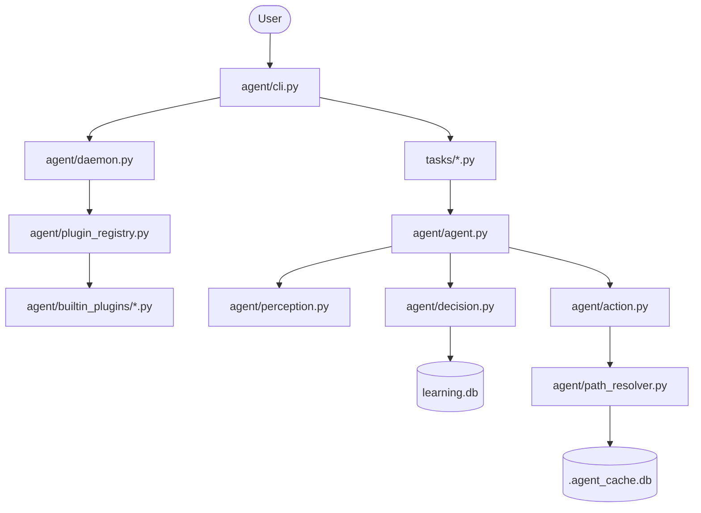

# Self-Learning AI Agent: Scripts Documentation

This document provides a comprehensive guide to every script in the repository, explaining its purpose, architecture, and safety for modification.

## 📂 Project Structure

```text
Self-Learning AI Agent/
├── agent/                  # Core Agent Engine [CORE]
│   ├── builtin_plugins/    # Extensible Event Handlers [SAFE]
│   ├── action.py           # Action execution & refactoring logic
│   ├── agent.py            # Main Agent cycle (Perception-Decision-Action)
│   ├── cli.py              # Typer-based Command Line Interface
│   ├── config.py           # Daemon & Plugin configuration
│   ├── daemon.py           # Background watcher (Watchdog)
│   ├── decision.py         # Q-Learning logic & State mapping
│   ├── logger.py           # Structured logging setup
│   ├── memory.py           # Short-term experience storage
│   ├── package_manager.py  # Package-aware module mapping
│   ├── path_filter.py      # Git-aware file ignoring
│   ├── path_resolver.py    # Reference updating (Rope/AST)
│   ├── perception.py       # Workspace scanning
│   ├── plugin_registry.py  # Dynamic plugin loader
│   └── sqlite_dao.py       # Q-Table persistence layer
├── tasks/                  # Automated Workflows [SAFE]
│   ├── file_cleanup.py     # Empty directory removal
│   └── file_sorting.py     # AI-driven file organization
├── utils/                  # Shared Helpers [SAFE]
│   ├── config.py           # RL rewards & file type definitions
│   └── logger.py           # Global logging utility
├── tests/                  # Unit & Integration Tests
├── main.py                 # CLI Entry point
└── verify_*.py             # End-to-end verification scripts
```

---

## 🔄 Data Flow Diagram



---

## ⚡ Quick Reference: "I want to..."

| Action | File to Edit | Safety |
| :--- | :--- | :--- |
| **Change how files are categorized** | [utils/config.py](file:///c:/Users/kesha/OneDrive/Desktop/Self_Learning%20AI%20Agent/utils/config.py) | ✅ Safe |
| **Adjust AI rewards/learning rate** | [utils/config.py](file:///c:/Users/kesha/OneDrive/Desktop/Self_Learning%20AI%20Agent/utils/config.py) | ✅ Safe |
| **Add a new background task** | [agent/builtin_plugins/](file:///c:/Users/kesha/OneDrive/Desktop/Self_Learning%20AI%20Agent/agent/builtin_plugins/) | ✅ Safe |
| **Add a new CLI command** | [agent/cli.py](file:///c:/Users/kesha/OneDrive/Desktop/Self_Learning%20AI%20Agent/agent/cli.py) | ⚠️ Core |
| **Change the Q-Learning math** | [agent/decision.py](file:///c:/Users/kesha/OneDrive/Desktop/Self_Learning%20AI%20Agent/agent/decision.py) | ⚠️ Core |
| **Fix a bug in file moving** | [agent/action.py](file:///c:/Users/kesha/OneDrive/Desktop/Self_Learning%20AI%20Agent/agent/action.py) | ⚠️ Core |
| **Modify ignored files/folders** | [agent/path_filter.py](file:///c:/Users/kesha/OneDrive/Desktop/Self_Learning%20AI%20Agent/agent/path_filter.py) | ⚠️ Core |

---

## 📝 Detailed Script Breakdown

### Root Scripts

#### [main.py](file:///c:/Users/kesha/OneDrive/Desktop/Self_Learning%20AI%20Agent/main.py) [SAFE TO MODIFY]
- **Purpose**: The primary entry point for the application. It simply imports and runs the CLI application.
- **Key Elements**: Calls `app()` from `agent.cli`.
- **Dependencies**: `agent.cli`
- **Used By**: None (Entry point)

#### [create_demo.py](file:///c:/Users/kesha/OneDrive/Desktop/Self_Learning%20AI%20Agent/create_demo.py) [SAFE TO MODIFY]
- **Purpose**: Utility to generate a mock workspace with various file types (PDF, JPG, PY) for testing the agent's sorting capabilities.
- **Key Elements**: `files_to_create` list, file generation loop.
- **Dependencies**: `os`, `shutil`
- **Used By**: Manual testing

#### [e2e_learning_flow.py](file:///c:/Users/kesha/OneDrive/Desktop/Self_Learning%20AI%20Agent/e2e_learning_flow.py) [SAFE TO MODIFY]
- **Purpose**: End-to-end verification script for learning persistence. It runs a sorting task and verifies that Q-values are saved to SQLite.
- **Key Elements**: `setup_workspace()`, `main()` logic with assertions.
- **Dependencies**: `tasks.file_sorting`, `agent.sqlite_dao`
- **Used By**: CI/CD or manual verification

---

### Agent Core (`agent/`)

#### [agent.py](file:///c:/Users/kesha/OneDrive/Desktop/Self_Learning%20AI%20Agent/agent/agent.py) [CORE - DO NOT TOUCH]
- **Purpose**: Orchestrates the core loop of the agent. It manages Perception, Decision, Action, and Learning in a single cycle.
- **Key Elements**: `SelfLearningAgent` class, `run_cycle()` method, `calculate_reward()` logic.
- **Dependencies**: `.perception`, `.action`, `.memory`, `.decision`, `utils.config`
- **Used By**: `tasks/file_sorting.py`

#### [cli.py](file:///c:/Users/kesha/OneDrive/Desktop/Self_Learning%20AI%20Agent/agent/cli.py) [CORE - DO NOT TOUCH]
- **Purpose**: Implements the Command Line Interface using Typer. Handles commands like `start`, `stop`, `sort`, `move`, and `accuracy`.
- **Key Elements**: `app = Typer()`, `start()`, `stop()`, `status()`, `sweep()`, `accuracy()`.
- **Dependencies**: `typer`, `rich`, `.daemon`, `.repo_manager`, `.path_filter`, `.plugin_registry`, `agent.sqlite_dao`
- **Used By**: `main.py`

#### [decision.py](file:///c:/Users/kesha/OneDrive/Desktop/Self_Learning%20AI%20Agent/agent/decision.py) [CORE - DO NOT TOUCH]
- **Purpose**: Contains the Reinforcement Learning logic. It maps file states to actions and updates the Q-table based on rewards.
- **Key Elements**: `QLearningDecision` class, `choose_action()`, `learn()`, `get_state_key()`.
- **Dependencies**: `agent.sqlite_dao`, `utils.config`
- **Used By**: `agent/agent.py`

#### [daemon.py](file:///c:/Users/kesha/OneDrive/Desktop/Self_Learning%20AI%20Agent/agent/daemon.py) [CORE - DO NOT TOUCH]
- **Purpose**: Implements the background watcher service using `watchdog`. It listens for file system events and dispatches them to plugins.
- **Key Elements**: `DaemonWatcher` class, `WorkspaceHandler` (event dispatcher), graceful shutdown logic.
- **Dependencies**: `watchdog`, `.path_filter`, `.plugin_registry`
- **Used By**: `agent/cli.py`

#### [action.py](file:///c:/Users/kesha/OneDrive/Desktop/Self_Learning%20AI%20Agent/agent/action.py) [CORE - DO NOT TOUCH]
- **Purpose**: Executes physical file operations and triggers reference updates. It ensures integrity through syntax checks and tests after moves.
- **Key Elements**: `ActionExecutor` class, `move_file()` method, integration with `PathResolver`.
- **Dependencies**: `shutil`, `.path_resolver`, `utils.logger`
- **Used By**: `agent/agent.py`, `agent/cli.py`, `verify_waste_seg.py`

#### [path_resolver.py](file:///c:/Users/kesha/OneDrive/Desktop/Self_Learning%20AI%20Agent/agent/path_resolver.py) [CORE - DO NOT TOUCH]
- **Purpose**: Handles the "Intelligence" of file moving. It updates imports in Python files (using Rope/CST) and references in MD/JSON/TXT files.
- **Key Elements**: `PathResolver` class, `update_references()`, `_update_python_references()`, `verify_syntax()`.
- **Dependencies**: `rope`, `libcst`, `.package_manager`
- **Used By**: `agent/action.py`

#### [package_manager.py](file:///c:/Users/kesha/OneDrive/Desktop/Self_Learning%20AI%20Agent/agent/package_manager.py) [CORE - DO NOT TOUCH]
- **Purpose**: Maintains a mapping of Python modules to file paths. It helps `PathResolver` understand the package structure (e.g., `__init__.py` locations).
- **Key Elements**: `PackageManager` class, `build_module_map()`, `discover_packages()`.
- **Dependencies**: `sqlite3`, `pathlib`, `utils.logger`
- **Used By**: `agent/path_resolver.py`

#### [sqlite_dao.py](file:///c:/Users/kesha/OneDrive/Desktop/Self_Learning%20AI%20Agent/agent/sqlite_dao.py) [CORE - DO NOT TOUCH]
- **Purpose**: Data Access Object for the SQLite database. Persists the Q-table so the agent "remembers" its training between restarts.
- **Key Elements**: `SQLiteDAO` singleton, `get_q()`, `set_q()`, `all_entries()`.
- **Dependencies**: `sqlite3`, `threading`
- **Used By**: `agent/decision.py`, `agent/cli.py`, `e2e_learning_flow.py`

#### [path_filter.py](file:///c:/Users/kesha/OneDrive/Desktop/Self_Learning%20AI%20Agent/agent/path_filter.py) [CORE - DO NOT TOUCH]
- **Purpose**: Decides which files the agent should ignore. It combines hardcoded defaults, user config, and `.gitignore` patterns.
- **Key Elements**: `PathFilter` class, `should_ignore()`, `PathSpec` integration.
- **Dependencies**: `pathspec`, `pathlib`
- **Used By**: `agent/daemon.py`, `agent/cli.py`

#### [plugin_registry.py](file:///c:/Users/kesha/OneDrive/Desktop/Self_Learning%20AI%20Agent/agent/plugin_registry.py) [CORE - DO NOT TOUCH]
- **Purpose**: Dynamically loads and runs plugins from the plugins directory. It allows the daemon to be extended without modifying core code.
- **Key Elements**: `PluginRegistry` class, `discover()`, `run_all()`, `_load_plugin()` (dynamic import).
- **Dependencies**: `importlib`, `pathlib`
- **Used By**: `agent/daemon.py`, `agent/cli.py`

---

### Built-in Plugins (`agent/builtin_plugins/`)

#### [file_sorter.py](file:///c:/Users/kesha/OneDrive/Desktop/Self_Learning%20AI%20Agent/agent/builtin_plugins/file_sorter.py) [SAFE TO MODIFY]
- **Purpose**: A plugin that listens for new file events and triggers the sorting logic. It acts as the bridge between the Daemon and the Sorter.
- **Key Elements**: `run()` function, `PLUGIN_NAME`, `PLUGIN_VERSION`.
- **Dependencies**: `logging`
- **Used By**: `PluginRegistry` (Dynamically loaded)

#### [code_cleanup.py](file:///c:/Users/kesha/OneDrive/Desktop/Self_Learning%20AI%20Agent/agent/builtin_plugins/code_cleanup.py) [SAFE TO MODIFY]
- **Purpose**: A plugin that monitors file events to perform automated cleanup (like removing empty folders or linting).
- **Key Elements**: `run()` function, `PLUGIN_NAME`.
- **Dependencies**: `logging`
- **Used By**: `PluginRegistry` (Dynamically loaded)

---

### Workflows (`tasks/`)

#### [file_sorting.py](file:///c:/Users/kesha/OneDrive/Desktop/Self_Learning%20AI%20Agent/tasks/file_sorting.py) [SAFE TO MODIFY]
- **Purpose**: High-level task that runs multiple "Episodes" of the agent's sorting cycle to organize a workspace.
- **Key Elements**: `run_file_sort_task()`.
- **Dependencies**: `agent.agent`, `utils.config`
- **Used By**: `agent/cli.py`, `e2e_learning_flow.py`

#### [file_cleanup.py](file:///c:/Users/kesha/OneDrive/Desktop/Self_Learning%20AI%20Agent/tasks/file_cleanup.py) [SAFE TO MODIFY]
- **Purpose**: Rule-based task that scans a workspace and removes empty directories to keep the filesystem clean.
- **Key Elements**: `run_cleanup_task()`, `os.walk` logic.
- **Dependencies**: `utils.config`, `utils.logger`
- **Used By**: `agent/cli.py`

---

### Utilities (`utils/`)

#### [config.py](file:///c:/Users/kesha/OneDrive/Desktop/Self_Learning%20AI%20Agent/utils/config.py) [SAFE TO MODIFY]
- **Purpose**: Central location for user-tweakable settings. Defines RL parameters (learning rate, rewards) and file category mappings.
- **Key Elements**: `SUPPORTED_FILE_TYPES` dictionary, `REWARDS` dictionary.
- **Dependencies**: `os`
- **Used By**: Almost every script

#### [logger.py](file:///c:/Users/kesha/OneDrive/Desktop/Self_Learning%20AI%20Agent/utils/logger.py) [SAFE TO MODIFY]
- **Purpose**: Provides a standardized logger that outputs to both the console and `agent.log`.
- **Key Elements**: `get_logger()` function.
- **Dependencies**: `logging`, `.config`
- **Used By**: Most scripts
